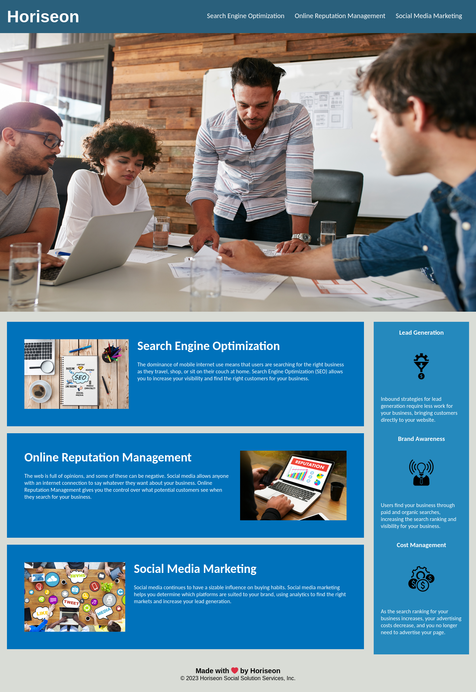

# Horiseon

This webpage highlights the key focal points of Horiseon and how they benefit
their clients.

## Search Engine Optimization (SEO)

This section highlights the dominance of mobile internet use by users searching
for the right business and how SEO helps makes these businesses visible to them.

## Online Reputation Management

This section highlights how social media allows anyone to leave a review, both
positive and negative, about a business and how online reputation management
gives a business control over what potential customers can see when searching
for them.

## Social Media Marketing

This section highlights how the use of analytics can be used to discover the
most effective social media platform to target for marketing.

## Benefits

In addition to the 3 key focal points above, 3 benefits are also brought up:

1. Lead Generation

1. Brand Awareness

1. Cost Management

## Project Structure

The following structure is used for this project:

```sh
├── assets
│   ├── css
│   │   └── style.css # CSS for index.html
│   └── images
│       ├── brand-awareness.png
│       ├── cost-management.png
│       ├── digital-marketing-meeting.jpg
│       ├── lead-generation.png
│       ├── online-reputation-management.jpg
│       ├── search-engine-optimization.jpg
│       └── social-media-marketing.jpg
├── index.html # entry point of website
└── README.md

```

### Webpage

The webpage can be publicly accessed
[HERE](https://snappergee.github.io/horiseon-assignment-01/) and below is a
screen shot of what it looks like:



### Contact information

All inquiries regarding technical aspects of this webpage can be emailed to
[dev support](mailto:dev-support@horiseon.com)
